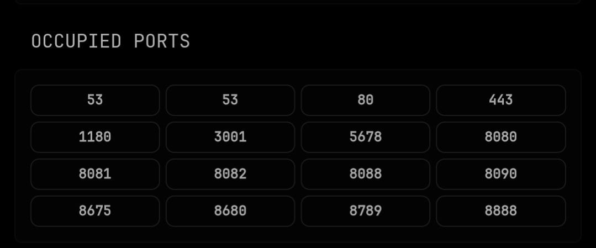

# Occupied Ports Widget for Glance

A tiny helper service that exposes **currently published Docker host ports** as JSON for a Glance `custom-api` widget.

This is useful when you are about to deploy a new service and want a quick visual list of ports already in use.

---

## Screenshot



---

## Features

- Dynamic port discovery from running Docker containers
- Deduplicated by **port number** (protocol variants collapsed)
- Sorting modes: `asc`, `desc`, `recent`
- Port range filter (`MIN_PORT`, `MAX_PORT`)
- Reserved port hints in payload (e.g. 22/53/80/443)
- Clickable links per port (`LINK_SCHEME://LINK_HOST:port`)
- Status envelope (`ok`, `error`, `count`) for safer widget rendering
- Production-oriented runtime (Gunicorn, non-root user, healthcheck)
- Basic CI with tests + Docker build check (GitHub Actions)
- Works well with Glance `custom-api` widgets

---

## How it works

- `occupied-ports-widget` calls Docker Engine API via a restricted `docker-socket-proxy`
- It reads running containers and collects `PublicPort` mappings
- It returns JSON in this shape:

```json
{
  "ok": true,
  "error": "",
  "sort_mode": "asc",
  "min_port": 1,
  "max_port": 65535,
  "count": 2,
  "items": [
    { "port": 53, "proto": "tcp", "url": "http://127.0.0.1:53", "reserved": true, "reserved_label": "DNS" },
    { "port": 8088, "proto": "tcp", "url": "http://127.0.0.1:8088", "reserved": false, "reserved_label": "" }
  ]
}
```

---

## Run with Docker Compose

```bash
docker compose up -d --build
```

Helper API:

- `GET /health`
- `GET /ports`

Local test:

```bash
curl http://127.0.0.1:8789/ports
```

---

## Glance configuration

Add this widget to your `glance.yml`:

```yaml
- type: custom-api
  title: Occupied Ports
  cache: 15s
  url: http://host.docker.internal:8789/ports
  template: |
    <style>
      .ports-grid {
        display: grid;
        grid-template-columns: repeat(4, minmax(0, 1fr));
        gap: 0.4rem;
      }
      .ports-grid > li {
        list-style: none;
        margin: 0;
      }
      .port-chip {
        text-align: center;
        padding: 0.28rem 0.2rem;
        border-radius: 6px;
        border: 1px solid color-mix(in srgb, var(--color-text-base) 16%, transparent);
        background: color-mix(in srgb, var(--color-widget-background) 82%, var(--color-text-base) 18%);
        font-size: 1rem;
        font-weight: 600;
        color: var(--color-text-base);
        opacity: 0.97;
        display: block;
        transition: background-color 120ms ease, border-color 120ms ease, color 120ms ease;
      }
      .port-chip:hover {
        background: color-mix(in srgb, var(--color-widget-background) 72%, var(--color-primary) 28%);
        border-color: color-mix(in srgb, var(--color-primary) 45%, transparent);
      }
    </style>
    <ul class="list ports-grid collapsible-container" data-collapse-after="16">
      {{ range .JSON.Array "items" }}
        <li><div class="port-chip">{{ .Int "port" }}</div></li>
      {{ end }}
    </ul>
```

> If `host.docker.internal` is not reachable in your setup, replace with a reachable host address from inside the Glance container.

---

## Configuration

Environment variables (optional):

- `PORT` (default: `8789`)
- `DOCKER_API` (default: `http://occupied-ports-docker-proxy:2375/containers/json`)
- `TIMEOUT_SECONDS` (default: `6`)
- `CACHE_SECONDS` (default: `5`)
- `MIN_PORT` / `MAX_PORT` (defaults: `1` / `65535`)
- `SORT_MODE` (`asc` | `desc` | `recent`, default: `asc`)
- `SHOW_SOURCE` (`true|false`, default: `false`)
- `LINK_SCHEME` (default: `http`)
- `LINK_HOST` (default: `127.0.0.1`)
- `AUTH_ENABLED` (`true|false`, default: `false`)
- `WIDGET_TOKEN` (required when `AUTH_ENABLED=true`)
- `RATE_LIMIT_PER_MINUTE` (default: `120`)
- `DEBUG_ERRORS` (`true|false`, default: `false`)
- `TRUST_PROXY` (`true|false`, default: `false`)

---

## Security notes

- Docker socket access is sensitive. This project uses [`tecnativa/docker-socket-proxy`](https://github.com/Tecnativa/docker-socket-proxy) with minimal allowed scope (`CONTAINERS=1`, `POST=0`).
- Container hardening defaults are enabled: non-root runtime, read-only filesystem, `no-new-privileges`, dropped Linux capabilities, memory/CPU/pid limits.
- Optional API token auth is supported via `AUTH_ENABLED=true` + `WIDGET_TOKEN` and request header `X-Widget-Token`.
- Basic per-IP rate limiting is enabled (configurable via `RATE_LIMIT_PER_MINUTE`).
- Error responses are sanitized by default (`DEBUG_ERRORS=false`) to avoid leaking internals.
- Recommended for public exposure: place behind reverse proxy + TLS + IP allowlist and enable auth token.

---

## Development

Run tests locally:

```bash
pytest -q
```

---

## Acknowledgements

### AI-assisted development

This project was created with AI assistance (OpenClaw + GPT-based coding help) and reviewed/adjusted by the maintainer.

### Upstream/open-source projects used

- [`tecnativa/docker-socket-proxy`](https://github.com/Tecnativa/docker-socket-proxy) — restricted Docker API proxy used for safer Docker socket access.
- [`Flask`](https://github.com/pallets/flask) — lightweight Python web framework for the helper API.
- [`Requests`](https://github.com/psf/requests) — HTTP client used to query Docker API endpoints.
- [`Glance`](https://github.com/glanceapp/glance) — dashboard that renders this helper via `custom-api` widget.

---

## License

MIT
